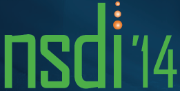

## Work Experience

<h3>Research Associate at NEC Europe Ltd,
Heidelberg - Germany </h3>
ClickOS / Network Function Virtualization ​​(Aug '12 - CURRENT)

 

Working on minimalistic and specialised virtual machines (5MB) to be used as network middleboxes, called ClickOS:
<ul>
<li>Changing the underlying backend and frontend drivers in Xen to improved packet I/O in virtual machines by a factor of 10, and beyond 10 Gb/s.</li>

<li>Improved boot times down to 30 miliseconds, by developing a toolstack ground up for Xen.</li>

<li>Heavily benchmarked and analysed the Xen network I/O from the guest down to the host.</li>

<li>Presented in top research conferences and also gave  a series of developer-oriented talks from Xen Summit, FOSDEM and USENIX NSDI earlier this year. The source code was recently made opensource as part of this project (https://cnp.neclab.eu).</li>
</ul>

 

<h3>Software Engineer at University of Aveiro, Aveiro - Portugal</h3>
HTML5 Webphone, Apollo​​(Set '11 - Jul '12)

 
 

<ul>
<li>Developed a rich voice-based communications solution which doesn’t resort to any fall back mechanisms (e.g. Flash, Java) and enables users to communicate directly between peers using HTML5 technologies (e.g. WebRTC or WebSockets media streaming) and through a specially designed transport gateway within an IMS network.</li>

<li>Both desktop and mobile were the target platforms of a yet to be released product called Whisper.</li>
</ul>

## Computer Skills

Frameworks/Packages: netmap, Click, Xen deployment, MiniOS, Xen driver development, Linux kernel development

Languages: C, C++, Python, Javascript, Java

Extras: HTML5, CSS, JS frameworks

## Side Projects

Web/Audio codecs:
 
* Speex.js (Javascript) (over 50+ stars)
* AMR.js (Javascript)
* Google WebRTC binding for Node.JS (C++)

 
As part of my ClickOS work:
 
* ClickOS (C++)
* Xen optimizations (C)
* MiniOS (C)
* Xen toolstack for fast boot times (C/Python)

## Talks

	
	 
	<b>USENIX NSDI 2014, April 4,</b>
	 
	<a href="https://www.usenix.org/conference/nsdi14/technical-sessions/presentation/martins"><i>ClickOS and the Art of Network Function Virtualization</i></a>
	 

 

	
	 
	<b>FOSDEM 2014, February 1 - 2</b>
	 
	<a href="http://ftp.osuosl.org/pub/fosdem/2014/UD2120_Chavanne/Saturday/High_Performance_Network_Function_Virtualization_with_ClickOS.webm"><i>High Performance Network Function Virtualization with ClickOS</i></a>

	
	 
	<b>Xen Developer Summit 2013, October 24 - 25</b>
	 
	<a href="http://www.xenproject.org/help/presentations-and-videos/video/latest/xpds13v-clickos.html"><i>Enabling Fast, Dynamic Network Processing with ClickOS</i></a>
	 

## Publications
 
***ClickOS and the Art of Network Function Virtualization***,

**Joao Martins**, Mohamed Ahmed (NEC Europe Ltd), Costin Raiciu, Vladimir Olteanu (University of Bucharest), Michio Honda, Roberto Bifulco, Felipe Huici (NEC Europe Ltd),

USENIX NSDI 2014

 

***Enabling Fast, Dynamic Network Processing with ClickOS***

**Joao Martins**, Mohamed Ahmed (NEC Europe Ltd), Costin Raiciu (University of Bucharest), Felipe Huici (NEC Europe Ltd)

SIGCOMM HotSDN 2013 Workshop

  

***Towards Minimalistic, Virtualized Content Caches with Minicache***,

Simon Kuenzer, **Joao Martins**, Mohamed Ahmed, Felipe Huici (NEC Europe Ltd),

CoNEXT HotMiddlebox 2013 Workshop

 

***Rethinking Access Networks with High Performance Virtual Software BRASes***

Roberto Bifulco, Thomas Dietz, Felipe Huici, Mohamed Ahmed, **Joao Martins**, Saverio Niccolini, Hans-Joerg Kolbe (NEC Europe Ltd),

EWSDN 2013 Workshop

 